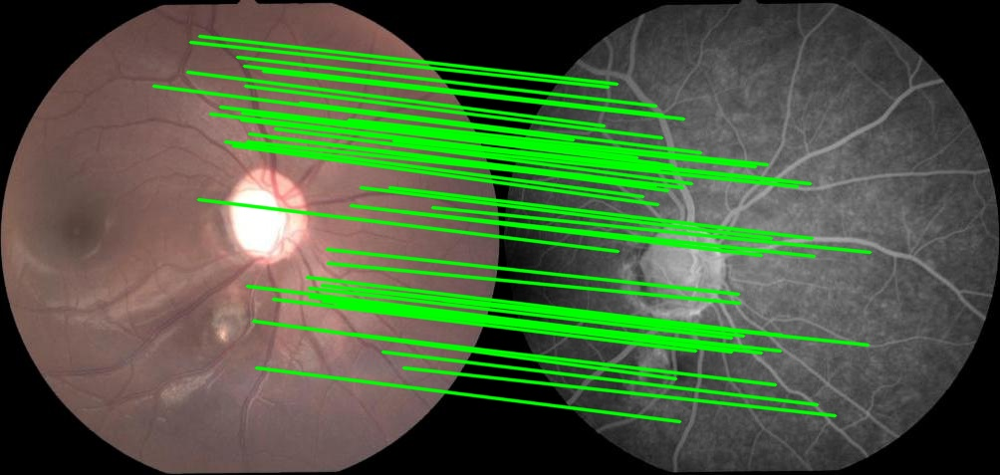

# Demo

## Requirements

- CMake

- Git

- C/C++ compiler
- OpenCV

## Linux

### How to build

```
$ git clone https://github.com/garethwang/LPM_OpenCV.git
$ cd LPM_OpenCV
$ mkdir build
$ cd build
$ cmake ../
$ make
```

### How to run

```
$ cd ..
$ ./build/demo_lpm ./data/matches.txt ./data/retina0.jpg ./data/retina1.jpg
```

## windows

### How to build

```
$ git clone https://github.com/garethwang/LPM_OpenCV.git
$ cd LPM_OpenCV
$ mkdir build
$ cd build
$ cmake-gui ../
```

- Click  on Configure to process CMakeLists.txt
- Set the OpenCV_DIR to find OpenCV library.
- Click on Configure again.
- Click on Generate.
- Close the cmake-gui.

```
$ cd ..
$ cmake --build build
```

### How to run

```
$ ./build/Debug/demo_lpm.exe ./data/matches.txt ./data/retina0.jpg ./data/retina1.jpg
```

## Result



